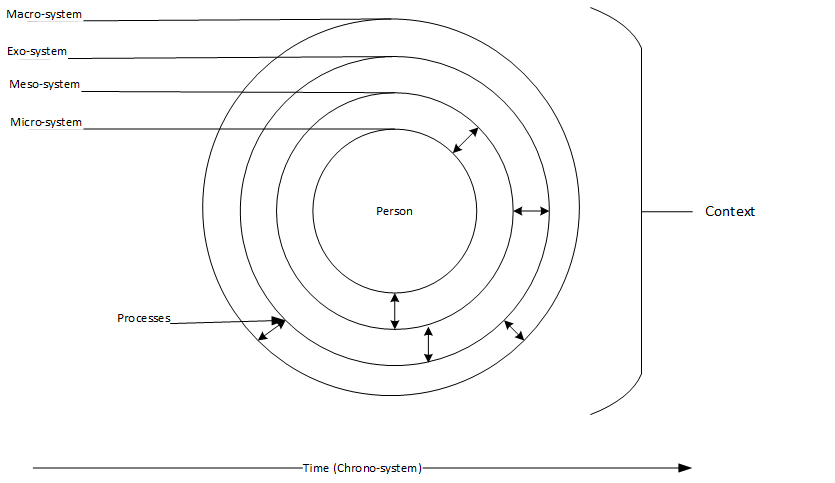
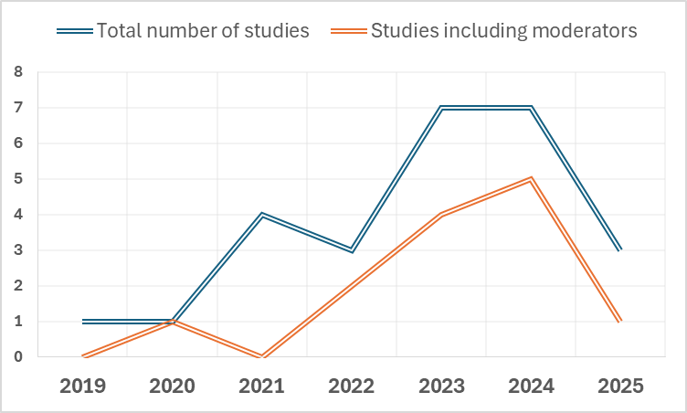

```{r include = FALSE}
#https://www.matthewvanaman.com/blog/guide-to-collaborative-writing-r-markdown-google/
set.seed(42)
results_folder <- "../lsac_emotional_development"
mask = TRUE
# this does nothing for apa_table:
options(knitr.kable.NA = '')
knitr::opts_chunk$set(
  echo = FALSE
)
papaja::r_refs("lsac_forest.bib")
library("worcs")
knitr::opts_chunk$set(echo = FALSE, message = FALSE, warning = FALSE, cache.extra = knitr::rand_seed)
options(tinytex.engine_args = '--shell-escape')

# Load descriptives
usethis::with_project(results_folder, {
  desc <- read.csv("codebook_df_anal.csv")
  desc <- desc[!grepl("_\\d_[mfc]$", desc$name), ]
desc <- desc[!grepl("^id(\\.\\d)?$", desc$name), ]
max_n <- max(desc$n)
desc_it <- read.csv("descriptives_items.csv")
sel_vars <- read.csv("selected_variables.csv")

# Find correct sample size for items
renames <- sel_vars$Variable.Name
names(renames) <- sel_vars$rename
desc_it_n <- desc_it$n
names(desc_it_n) <- desc_it$name
desc_it_n <- desc_it_n[which(names(desc_it_n) %in% renames[desc$name])]
names(desc_it_n) <- names(renames)[match(names(desc_it_n), renames)]
desc$n[match(names(desc_it_n), desc$name)] <- desc_it_n

desc$n[which(desc$name %in% sel_vars$rename)] <- desc_it$n[match(sel_vars$Variable.Name[na.omit(match(desc$name, sel_vars$rename))], desc_it$name)]

# Correct sample size for others
desc$n[!desc$name %in% sel_vars$rename] <- paste0("<= ", max_n)

tab_invar <- read.csv("measurement_invariance.csv")
names(tab_invar) <- c("Chi sq.", "df", "CFI", "TLI", "RMSEA", "srmr", "Variable", "items", 
"min. rel.", "max. rel.")
tab_invar$Model <- c("configural", "metric")
tab_invar <- tab_invar[, c("Variable", "Model", "items", "Chi sq.", "df", "CFI", "TLI", "RMSEA", "min. rel.", "max. rel.")]
})

```


Not all children experiencing supportive parenting thrive, and not all children raised with adversity struggle. 
Yet, adolescents who do develop internalizing problems face heightened risks for long-term difficulties [@clayborneSystematicReviewMetaAnalysis2019; @fangAnxietyAdolescentsSubsequent2024].
Identifying which adolescents are most at risk is therefore critical.
However, many empirical studies have overlooked heterogeneity in parenting effects [@boeleOvertimeFluctuationsParenting2020; @keijsersMeasuringParentAdolescent2022], leaving key gaps in our understanding of how parenting shapes internalizing problems beyond ‘the average family’.
This empirical gap challenges prevention efforts, as average effects may mask meaningful differences and lead to interventions that miss those most in need.
This exploratory study aims to fill this gap by exploring 129 potential moderators of within-family effects of parenting (i.e., warmth, inductive reasoning, and angry parenting) on adolescents' internalizing problems.
A biennial timescale allows us to capture macro-developmental processes.
We used the SEM-forests algorithm [@brandmaierTheoryguidedExplorationStructural2016] to identify the most important moderators of within-family predictive effects, which were modeled using random-intercept cross-lagged panel models (RI-CLPMs). 

## How Parents’ contribute to their child’s  the Development of Internalizing Problems is expected to be different from family to family

Parents contribute to their adolescents' emotional well-being, including internalizing problems, but how is likely different from family to family.
Developmental and parenting theories emphasize that the way a parenting practice is affecting a child’s well-being might depend, among others, on the child’s personality [@belskyDiathesisStressDifferential2009] and legitimacy beliefs of their parents’ authority [REF Darling..],
the parents’ overall parenting style [REF Darling & Steinberg, 1993],
and the family’s culture [@soenensLetUsNot2015].
Idiosyncratic theoretical approaches [@UsingTemporalNetwork2022] even propose that adolescents follow their own unique developmental pathways, each uniquely influenced by parenting practices.
Accordingly, the principle of multifinality suggests that the same parenting practice may lead to different outcomes across individuals [@cicchettiEquifinalityMultifinalityDevelopmental1996].
Hence, which parenting practices and how they affect adolescents' development of internalizing problems is a heterogeneous phenomenon. 

Ecological models further emphasize that parenting effects emerge from a complex interplay of individual, relational, and contextual factors.
For example, the Bioecological model [@bronfenbrennerBioecologicalModelHuman2007]
<!-- (Bronfenbrenner & Evans, 2000; Ferguson & Evans, 2019) -->
posits that development is the result of processes between the person and the multi-layered contexts they are embedded in, ranging from the micro-system, via the meso-system and exo-system, to the macro-system, while the chrono-system described how processes unfold over time (Figure \@ref(fig:figbioecological)).
The micro-system includes contexts with which the person has direct contact, e.g., the family, the school;
the meso-system reflects intersections among these contexts;
the exo-system reflects structures that impact the developing child but do not contain it;
the macro-system reflects cultures and subcultures [@fergusonSocialEcologicalTheory2019].
Given such influences on child development, we can expect that parenting effects are likely characterized by substantial heterogeneity; what is adaptive in one family, might be maladaptive in another.
Yet, empirical research lacks studies tapping into heterogeneity in parenting effects.

```{r figbioecological, fig.cap="The Bioecological Model of Development (adapted from Ferguson & Evans, 2019)."}

```

## Status Quo of Empirical Parenting Research: Focus on Within-Family Effects but Still Overlooking Theorized Heterogeneity

Although developmental theories emphasize that parenting effects are heterogeneous, longitudinal research has mostly examined what happens in the “average family.” Over the past decade, however, an important methodological revolution has taken place. New approaches, such as the random-intercept cross-lagged panel model [RI-CLPM, @hamakerCritiqueCrosslaggedPanel2015], separate stable between-family differences from within-family processes.
This allows researchers to examine how changes in parenting relate to changes in the development of a particular child.
The use of RI-CLPMs has expanded rapidly (see Figure \@ref(fig:figsystematicsearch)) and has reshaped conclusions from earlier work.
One persistent finding is that parenting effects often appear smaller or even absent when examined using within-family models [@vanlissaRoleFathersMothers2019; @boeleDirectionEffectsParenting2023].
One proposed explanation, that such effects might occur at a younger age, was not supported by empirical research [@vanlissaMothersFathersQuantitative2020].
<!-- ; Dawson & Samek, 2022; Franssens et al., 2021) -->

A second potential explanation is that parenting effects, while often small or non-significant on average, might vary across families.
Testing this explanation would require a systematic examination of heterogeneity in within-family parenting effects, for example, via moderator analysis.
An early review found that only four of twelve studies of within-family lagged parenting effects considered moderation [REF Boele et al., 2017].
<!-- The same is true in more recent RI-CLPM applications (e.g., Meuleman et al., 2024; Nelemans et al., 2020). -->
<!-- CJ: Maybe merge these two sentences, or just cite Meuleman in addition to Boele? -->
<!-- , despite the availability of guidelines for testing moderation (Mulder & Hamaker, 2020; Speyer et al., 2022). -->
Seminal studies that investigated moderation have focused on a single moderator, 
for example, adolescent- or parent sex [@vrolijkLongitudinalLinkagesFather2020], or mothers’ and fathers’ relative involvement in childrearing [@vanlissaMothersFathersQuantitative2020].
Guidelines for RI-CLPM moderator analysis similarly focus on including one moderator via multi-group analysis [@mulderThreeExtensionsRandom2021].
Yet providing a comprehensive answer to the question what between-family differences make a difference for the effect of parenting would require casting a wider net than structural equation modeling allows without running into power- or convergence issues.
The machine learning algorithm SEM-forests, by contrast, allows for comprehensive moderator analysis - but has not previously been applied to the RI-CLPM.

In sum, methodological innovations have shifted the field of parenting research from between-family to within-family research, but comprehensive investigations of heterogeneity in within-family effects has yet to follow.
In other words, the so-called "heterogeneity revolution" [@bryanBehaviouralScienceUnlikely2021] has not yet reached parenting research.
Crucially, this leaves a central theoretical assumption largely untested: adolescents may not be uniformly affected by the same parenting practice in their development of internalizing problems [@bronfenbrennerDevelopmentalScience212000].

```{r figsystematicsearch, fig.cap="Number of published peer-reviewed studies using RI-CLPMs to study the within-person prospective link between parenting and adolescents’ internalizing problems.^[info on keywords, systematic search performed on 31st of July 2025]"}

```

## The Present Study

With moderators of parenting effects largely unexplored, a key empirical question remains understudied: What distinguishes families in which, for example, parental warmth is beneficial from those in which it is not?
This study addresses that question by examining a broad set of potential moderators in the biennial within-family effects of two need-supporting (warmth, inductive reasoning) and one need-thwarting (angry parenting) practice [@soenensParentingAdolescents2019] on adolescent internalizing problems.
We cast a wide net across potential risk and protective factors, and apply SEM-forests - person-centered machine learning method - to identify which of these moderators are most influential [@brandmaierTheoryguidedExplorationStructural2016].
This exploratory approach can complement theory by revealing hitherto unstudied moderators,
provides guidance for theory-testing research by allowing researchers to prioritize more important factors,
and may inform personalized interventions by identifying who is most at risk.

# Method

All analyses were conducted in `r papaja::cite_r()`.
The Workflow for Open Reproducible Code in Science (WORCS) was used to make the research archive reproducible  [@vanlissaWORCSWorkflowOpen2020].
Code and supplemental materials are available at <https://github.com/cjvanlissa/lsac_emotional_development>.
The data and study documentation are available under controlled access via <https://aifs.gov.au/growing-up-in-australia>.

## Participants and procedure

Participants were `r desc$n[which(desc$name == "Age")]` children and their `r desc$n[which(desc$name == "age_m")]` mothers and `r desc$n[which(desc$name == "age_f")]` fathers enrolled in the Longitudinal Study of Australian Children [LSAC, @australianinstituteoffamilystudiesGrowingAustralia2020].
<!-- repeated measures of parenting practices and child internalizing symptoms, separately reported for mothers and fathers. The analytic dataset excluded any identifier variables and recoded categorical variables for analysis consistency (e.g., recoding upper categories in extracurricular activities and child support to preserve ordinal structure). -->

## Measures

The primary predictors (hereafter: predictors) were parenting practices reported by both mothers and fathers on five-point Likert scales (from "Never" to "Always"), namely warmth (*"Express affection by hugging, kissing and holding this child"*), anger (*"Of all the times you talk to this child about his/her behaviour, how often is this disapproval"*), and inductive reasoning [*"Explain to this child why he/she was being corrected"*, see @zubrickParentingMeasuresLongitudinal2014].^[Consistency and monitoring were also considered, but omitted due to unacceptable psychometric properties.]

The primary outcome variable (hereafter: outcome, or internalizing symptoms) the child-reported Emotional Problems sub-scale of the Strengths and Difficulties Questionnaire [SDQ, @goodmanPsychometricPropertiesStrengths2001], assessed on a three-point Likert scale (from "Not true" to "Certainly true"; e.g. "*I am often unhappy, depressed or tearful*").

Predictors and outcomes were assessed biannually for four waves (except warmth, which was assessed for three waves).
Confirmatory factor analyses (CFA) indicated that metric invariance could be assumed across waves and (for predictors) across parents, see Table \@ref(tab:tabinvar).
We considered RMSEA < .06, CFI > .95 and TLI > .95 to indicate good model fit [@huCutoffCriteriaFit1999].
Composite reliability for each scale was good for all scales across respondents and timepoints [@greenReliabilitySummedItem2009],
except for anger, whose reliability in wave four was below $\alpha = .59$ for both mothers and fathers.
Since our focus is on the longitudinal effects of parenting practices in waves one to three on internalizing symptoms in waves two to four, we do not consider this to be problematic.

```{r tabinvar}
usethis::with_project(results_folder, {
  tab_invar <- read.csv("measurement_invariance.csv", stringsAsFactors = FALSE)
})

tab_invar <- tab_invar[, c("model", "items", "chisq", "df", "rmsea", "cfi", "tli", 
"min_rel_lv", "max_rel_lv")]
tab_invar <- tab_invar[!tab_invar$model %in% c("con", "mon"), ]
tab_invar$model <- factor(tab_invar$model, levels = c("emo", "war", "con", "ang", "mon", "ind"), labels = c("SDQ Int.", "Warmth", "Consistency", "Anger", "Monitoring", "Ind. Reas."))
tab_invar$model <- paste0(tab_invar$model, c(" C", " M"))
names(tab_invar) <- c("Model", "Items", "$\\chi^2$", "df", "RMSEA", "CFI", "TLI", "rel$_{min}$", "rel$_{max}$")
knitr::kable(tab_invar, digits = 2, caption = "CFAs for outcome (SDQ Int.) and predictors. C: Configural, M: metric invariance.")
```

### Moderator Variables

```{r}
usethis::with_project(results_folder, {
scls <- read.csv("descriptives_scales.csv", stringsAsFactors = FALSE)
  interp <- read.csv("variable_interpretation.csv", stringsAsFactors = FALSE)
interp$name <- tolower(gsub(" .*$", "", interp$Variable))
desc <- merge(desc, interp, by = "name", all.x = TRUE)
desc$Person[is.na(desc$Person)] <- "NA"
desc$Resp <- factor(desc$Person, levels = c("NA", "Mother", "Father", "Father/Mother", "Not Applicable",  "Study Child", "Teacher/Carer", "Home"), labels = c("O", "M", "F", "M/F", "O", 
"C", "T/C", "NA"))
desc$unique <- desc$unique-1L
desc_cat <- desc
desc_cat$mode_prop <- desc_cat$mode/max_n
desc_cat$mode <- desc_cat$mode_value
print(names(desc_cat))
desc_cat <- desc_cat[!desc$type == "numeric", c("name", "n", "unique", "mode", "mode_prop", "v", "Resp", "Question", "Values")
]

})

desc_num <- desc[desc$type == "numeric" & !desc$name %in% scls$model, c("name", "n", "mean", "sd", "min", "max", "skew", "kurt", "Resp")]
desc_scl <- desc[desc$name %in% scls$model, c("name", "n", "mean", "sd", "min", "max", "skew", "kurt", "Resp")]
names(scls)[2] <- "name"
desc_scl <- merge(desc_scl, scls, by = "name", all.x = TRUE)
desc_scl <- desc_scl[, c("name", "mean", "sd", "min", "max", "skew", 
"kurt", "Resp", "items", "cfi", "tli", "rmsea", "rel_lv")]
```

We included `r nrow(desc)` moderators (hereafter: moderators), ranging from demographic variables to environmental factors.
Table \@ref(tab:tabcat) shows descriptive statistics for categorical variables, \@ref(tab:tabnum) for continuous variables,
and \@ref(tab:tabscal) for multi-item scales.
See [Supplementary Table S1](https://github.com/cjvanlissa/lsac_emotional_development/blob/a38bb8061a61e944f3f6c8e8532c9087084888ba/descriptives_scales.csv) for full information, including the questions and response options.

```{r tabcat}
knitr::kable(desc_cat[ , c("name", "n", "unique", "mode", "mode_prop", "v", "Resp")], caption = "Categorical moderator descriptive statistics. Unique: unique values, including missing. Mode: most common value. Mode_prop: proportion of cases with the mode value. V: categorical variable dispersion (similar to standard deviation for continuous variables). Resp: Respondent, M = mother, F = father, M/F = both, C = Child, O = other.",  digits = 2, row.names = FALSE)
```

```{r tabnum}
knitr::kable(desc_num, caption = "Numeric moderator descriptive statistics. Resp: Respondent, M = mother, F = father, C = Child, O = other, T/C = teacher/carer.",  digits = 2, row.names = FALSE)
```

```{r tabscal}
knitr::kable(desc_scl, caption = "Scale descriptive statistics. Resp: Respondent, M = mother, F = father, C = Child, O = other.",  digits = 2, row.names = FALSE)
```

## Strategy of analyses

We set out to identify the most important moderators of the effects of parenting practices on children's internalizing symptoms (or: moderators of parenting effects).
Missing data were imputed using 2-nearest neighbors [@kowarikImputationPackageVIM2016].
We used Random Intercept Cross-Lagged Panel Models to estimate the parenting effects [RI-CLPM, @hamakerCritiqueCrosslaggedPanel2015].
RI-CLPMs are longitudinal models that partition the repeated measurements of predictor- and outcome variables into two components: stable between-family differences in parenting and internalizing symptoms (random intercepts) and within-family deviations from this stable state.
We estimated separate RI-CLPMs for each parenting practice and parent.
All other parenting practices were included in the moderator set, to allow for interactions between parenting practices.
In an RI-CLPM, parenting effects can be interpreted as follows: If parents exibit higher levels of this parenting behavior than usual in one wave, does this predict a change in their children's internalizing symptoms in the next wave?

We used the machine learning method SEM-forests to identify potential moderators of parenting effects [@brandmaierTheoryguidedExplorationStructural2016].
A SEM-forest is comprised of several (in our case, 30) SEM-trees.
A SEM-tree is constructed by starting with the full sample, and identifying the moderator variable and its value which - when splitting the sample in two based on that variable and value - result in two post-split groups with the maximum possible difference in the value of a focal parameter as determined by a score-based test [@arnoldScoreGuidedStructuralEquation2021].
In our case, the focal parameter was the parenting effect's regression coefficient.
To illustrate: a SEM-tree might determine that splitting the sample into families who score above versus below a score of 1.72 on paternal anger results in two groups with maximally different values for the parenting effect's regression coefficient.
This splitting procedure is iteratively repeated for each of the post-split groups, and continues until a post-split group reaches a given minimum sample size (in our case: 200 cases).
Single trees are readily interpretable as a flowchart of binary branching decisions.
This interpretability comes at a cost of a loss of predictive performance; a single tree does not comprehensively explore all different ways in which differences in parenting effect might arise, or consider all moderators. 
It selects the best moderator to perform a split.
If several moderators are approximately equally good, or interchangeable, it only picks one.
Thus, a single tree illustrates one possible way in which differences in parenting effects might arise.

SEM forests capture greater nuance in the relationships between moderators and parenting effects by combining several trees that each explore the data in different ways.
This is achieved by bootstrapping the sample for each tree in the forest,
and by randomly selecting (in our case, 12) moderators to choose from at each split in the tree.
The analyses took approximately two weeks to complete on an Intel Xeon Gold 6130 2.10Ghz system and 32Gb of RAM.
The number of trees in the forest was set to 30 to allow for efficient paralellization across the system's 32 cores.

The primary outcome of interest was the relative importance of each moderator.
Importance is computed for each tree in the forest, by taking cases not included in that tree's bootstrap sample and using their values on the moderator values to traverse the tree until they reach a terminal node,
then computing the model fit (-2 log-likelihood) for those cases given the model in that terminal node.
Then, each moderator is permuted in turn, thus losing any meaningful information it contained,
and then the tree is traversed again using those now-meaningless moderator values.
Variable importance is defined as the decrease in model fit that occurs after permuting a moderator.
If a moderator was important, then the model fit should become worse when it is shuffled.

The second outcome of interest was the marginal association of moderators with the parenting effect,
which is obtained by sampling a grid of values along the moderator (in our case, 20),
and drawing a random sample (in our case, n = 1000) of participants to determine the values of all other moderators, to average out their effect.
Then, the expected value of the parenting effect is calculated for those combinations of values, and plotted.
Since our analysis yields 774 such plots, they are not reprinted here, but they are available in the [online repository](https://cjvanlissa.github.io/lsac_emotional_development/#shape-of-association).

The third outcome of interest is a single tree for each parenting practice.
This single tree tells a data story of the kinds of between-family differences that make a difference for the effect of parenting practices on emotional development - but importantly, this should be seen as just one possible way in which between-family differences in parenting effects might arise, not as the only possible way.

We focused on the interpretation of the top 10 most important moderators for each model.
While this cutoff is arbitrary, it is defensible to focus more on top predictors because variable importance declines exponentially; thus, moderators not included in the top 10 are much less important than those included in the top 10.
The single trees were also grown on the top 10 most important moderators.

## Results

Figure \@ref(fig:figvim) below show the permutation importance for each parenting behavior, for mothers and fathers separately.
The approximate shape of the marginal association is summarized by the shape of each point in these plots.
The effect of moderators on parenting effects should be interpreted in the context of the distribution of family-specific parenting effects.
As Figure \@ref(fig:figboxplots) shows, on average, all parenting practices had negative effects,
although maternal warmth was near-zero on average.
Thus, maternal warmth's effect was positive in about half of families, and negative in the other half.
<!-- In the written description, we refer to specific variables by parent and number, e.g. the number one moderator of maternal warmth, father involvement, is M1.  -->
<!-- Point shape indicates the approximate shape of the relationship of each moderator with the parenting effect. -->

```{r figvim, fig.cap="Importance of the top 10 moderators for each parenting behavior. Labels indicate approximate shape of the moderator's relationship with the parenting effect, no: none, p: positive, n: negative, cn: concave, cv: convex, o: other. Axis label omitted because the scale (-2LL) has no intrinsic meaning, range: [0, 34]."}
knitr::include_graphics(file.path(results_folder, "vim_mf_pageplot.svg"))
```

```{r figboxplots, fig.cap="Boxplots of the family-specific effects of each parenting variable."}
knitr::include_graphics(file.path(results_folder, "parenting_effects_boxplots.svg"))
```

#### Warmth

<!-- INVOLVEMENT IS REVERSE-CODED! -->
For maternal warmth, the most important moderator (1) was *father involvement* (In the past month how often did you eat an evening meal with this child, from "Once a day or more" to "Not at all").
Its marginal relationship with the effect of mothers' warmth was flat.
Other important moderators were mother's (2) and fathers' (3) *life difficulties* (How difficult do you feel your life is at present?, from "No problems or stress" to "Very many problems and stresses").
These moderators positively attenuated the (negative) effect of mothers' warmth.
Whether or not the child had a *say* (4) in what the family does (negatively phrased: from "Always" to "Never") had a positive moderating effect.
How often someone in the household *helped the child with homework* (5) (from "5 or more days a week" to "Never")
had a concave effect, where both extremes showed a more negative effect of maternal warmth.
The child's *biological relationship* (6) to the parents ("no/yes") had a negative moderating effect.
Mothers' *coping* (from "A little" to "Extremely well") had a negative moderating effect, where "A little" was associated with positive, and higher values were associated with negative effects of warmth.
*Concerns at school* in the last 12 months (8) (No/Yes) had a negative moderating effect.
Child-perceived *family climate* (9; How often do people in your family yell at each other?, from "Never" to "Always") had a positive moderating effect.
Finally, how much the child *enjoyed physical activity* (10, from "A lot" to "Not at all") had a positive effect.

*Father involvement* was also paternal warmth's most important moderator (1), again with a flat effect.
The child's long-term medical condition or disability (2, *sick*, No/Yes) positively moderated the effect of fathers' warmth.
Fathers' (3) and mothers' (5) *life difficulties* (3) had a negative moderating effect.
Mothers' coping (4) had an approximately flat moderating effect.
*Concerns at school* (6) positively moderated the effect of fathers' warmth.
Whether the child was of *indigenous* (7) descent ("yes/no") positively moderated the effect of fathers' warmth.
*Family climate* (8) had a concave moderating effect, where the parenting effect of fathers' warmth was more negative at either ends of the scale.
Whether the study child had a *parent living elsewhere* (9, no/yes) had a positive moderating effect.
Finally, how much the child *enjoyed physical activity* (10, from "A lot" to "Not at all") had a negative moderating effect.

Many of the most important moderators for warmth were the same across mothers and fathers,
with an emphasis on micro-system characteristics.
For both, the most important moderator was (lack of) *father involvement*,
which stood out above all other moderators for paternal warmth.
Despite being the most important moderator, its marginal effect was flat.
A likely explanation is that its effect is expressed in interaction with other moderators.
Parent characteristics, like mothers' and fathers' *difficult life* and the related moderator, *mothers' coping*,
also ranked high for both.
The child-reported *family climate* was also important for both.
Finally, two adolescent characteristics ranked high for both:
children's *enjoyment of activity*, which might be an indicator of children's good health (notice *sick*, for father's warmth),
and *school concerns*.

For maternal warmth, several other micro-system characteristics were important, including whether the child had a *say* in what the family does, whether someone in the household *helped them with homework*, and whether the child was *biologically related to the parents*.
For paternal warmth, two micro-level family characteristics were important:
whether the child was of *indigenous* descent,
and whether they *had a parent living elsewhere*.
The latter strongly correlates with *biological relationship* (see mother effects), $r = .80$, so both might be indicators of an intact biological family.

#### Anger

While there was less consistency in the moderators of parental anger, it is noticable that, across both parents, factors related to fathers were more important than those related to mothers.

Caspar will finish writing this


Moderator one was enjoy_activity (The next questions ask about how you've been feeling over the last week. How much do you enjoy being physically active (doing things like sports, active games, walking or running, swimming)?, from "A lot" to "Not at all").
The marginal relationship of enjoy_activity with the parenting effect of mothers' inductive reasoning was flat.


Moderator two was coping_f (How well do you think you are coping?, from "Not at all" to "Extremely well").
The marginal relationship of coping_f with the parenting effect of mothers' inductive reasoning was negative.


Moderator three was difficult_life_m (How difficult do you feel your life is at present?, from "No problems or stress" to "Very many problems and stresses").
The marginal relationship of difficult_life_m with the parenting effect of mothers' inductive reasoning was positive.


Moderator four was indigenous (Is the family member of Aboriginal origin, Torres Strait Islander origin or both? Recoded to: either parent meets requirement, from "yes/no" to "yes/no").
The marginal relationship of indigenous with the parenting effect of mothers' inductive reasoning was flat.


Moderator five was move_distance (In study child's most recent move did he/she move…, from "Within this town or suburb?" to "From overseas?").
The marginal relationship of move_distance with the parenting effect of mothers' inductive reasoning was concave.


Moderator six was health_f (In general, would you say your own health is…?, from "Excellent" to "Poor").
The marginal relationship of health_f with the parenting effect of mothers' inductive reasoning was positive.


Moderator seven was family_climate_f (Sometimes family members may have difficulty getting along with one another. They do not always agree and they may get angry. In general, how would you rate your family’s ability to get along with one another?, from "Excellent" to "Poor").
The marginal relationship of family_climate_f with the parenting effect of mothers' inductive reasoning was positive.


Moderator eight was health (In general, how would you say study child’s current health is?, from "Excellent" to "Poor").
The marginal relationship of health with the parenting effect of mothers' inductive reasoning was negative.


Moderator nine was employed_f (P1 employed by Labour Force Survey definitionemployed by Labour Force Survey definition, from "Employed" to "Not in labour force"from "Employed" to "Not in labour force, Recoded to yes, no, no").
The marginal relationship of employed_f with the parenting effect of mothers' inductive reasoning was positive.


Moderator ten was coping_m (How well do you think you are coping?, from "Not at all" to "Extremely well").
The marginal relationship of coping_m with the parenting effect of mothers' inductive reasoning was negative.


Moderator one was involvement_f (In the past month how often did you...Eat an evening meal with this child, from "Once a day or more" to "Not at all").
The marginal relationship of involvement_f with the parenting effect of fathers' inductive reasoning was convex.


Moderator two was monitoring_difficult_m (How strongly do you agree or disagree with the following statement? "It is difficult to know where child is and what he/she is doing now that he/she is getting older.", from "Strongly disagree" to "Strongly agree").
The marginal relationship of monitoring_difficult_m with the parenting effect of fathers' inductive reasoning was convex.


Moderator three was enjoy_activity (The next questions ask about how you've been feeling over the last week. How much do you enjoy being physically active (doing things like sports, active games, walking or running, swimming)?, from "A lot" to "Not at all").
The marginal relationship of enjoy_activity with the parenting effect of fathers' inductive reasoning was convex.


Moderator four was health (In general, how would you say study child’s current health is?, from "Excellent" to "Poor").
The marginal relationship of health with the parenting effect of fathers' inductive reasoning was negative.


Moderator five was difficult_life_f (How difficult do you feel your life is at present?, from "No problems or stress" to "Very many problems and stresses").
The marginal relationship of difficult_life_f with the parenting effect of fathers' inductive reasoning was negative.


Moderator six was say_1 (How often do you have a say in what the family does, such as what to watch on TV, what to do on the weekends, where to go on family outings or holidays?, from "Always" to "Never").
The marginal relationship of say_1 with the parenting effect of fathers' inductive reasoning was positive.


Moderator seven was activities_extracurricular (In the last 12 months has child regularly participated in any of the following activities?('Regularly' means at least once a week, for three months or more e.g. a sports season)(Exclude activities done as part of the child's normal outside school hours care) Community group or club (e.g. scouts, guides or cultural group), No/Yes).
The marginal relationship of activities_extracurricular with the parenting effect of fathers' inductive reasoning was concave.


Moderator eight was sick_m (Does the family member have a medical condition or disability that has lasted for 6 months or more?, No/Yes).
The marginal relationship of sick_m with the parenting effect of fathers' inductive reasoning was negative.


Moderator nine was school_concerns (In the last 12 months has the school contacted you (or partner) because study child has behaved poorly at school?, No/Yes).
The marginal relationship of school_concerns with the parenting effect of fathers' inductive reasoning was positive.


Moderator ten was health_m (In general, would you say your own health is…?, from "Excellent" to "Poor").
The marginal relationship of health_m with the parenting effect of fathers' inductive reasoning was negative.


Moderator one was employed_f (P1 employed by Labour Force Survey definitionemployed by Labour Force Survey definition, from "Employed" to "Not in labour force"from "Employed" to "Not in labour force, Recoded to yes, no, no").
The marginal relationship of employed_f with the parenting effect of mothers' anger was positive.


Moderator two was say_1 (How often do you have a say in what the family does, such as what to watch on TV, what to do on the weekends, where to go on family outings or holidays?, from "Always" to "Never").
The marginal relationship of say_1 with the parenting effect of mothers' anger was positive.


Moderator three was enjoy_activity (The next questions ask about how you've been feeling over the last week. How much do you enjoy being physically active (doing things like sports, active games, walking or running, swimming)?, from "A lot" to "Not at all").
The marginal relationship of enjoy_activity with the parenting effect of mothers' anger was negative.


Moderator four was weight_concern (How concerned are you about child's weight at the moment?, from "Not at all" to "Very").
The marginal relationship of weight_concern with the parenting effect of mothers' anger was negative.


Moderator five was coping_f (How well do you think you are coping?, from "Not at all" to "Extremely well").
The marginal relationship of coping_f with the parenting effect of mothers' anger was negative.


Moderator six was Absenteeism (NA, NA).
The marginal relationship of Absenteeism with the parenting effect of mothers' anger was negative.


Moderator seven was difficult_life_m (How difficult do you feel your life is at present?, from "No problems or stress" to "Very many problems and stresses").
The marginal relationship of difficult_life_m with the parenting effect of mothers' anger was negative.


Moderator eight was difficult_life_f (How difficult do you feel your life is at present?, from "No problems or stress" to "Very many problems and stresses").
The marginal relationship of difficult_life_f with the parenting effect of mothers' anger was unclear (other).


Moderator nine was health (In general, how would you say study child’s current health is?, from "Excellent" to "Poor").
The marginal relationship of health with the parenting effect of mothers' anger was unclear (other).


Moderator ten was involvement_f (In the past month how often did you...Eat an evening meal with this child, from "Once a day or more" to "Not at all").
The marginal relationship of involvement_f with the parenting effect of mothers' anger was positive.


Moderator one was involvement_f (In the past month how often did you...Eat an evening meal with this child, from "Once a day or more" to "Not at all").
The marginal relationship of involvement_f with the parenting effect of fathers' anger was positive.


Moderator two was health (In general, how would you say study child’s current health is?, from "Excellent" to "Poor").
The marginal relationship of health with the parenting effect of fathers' anger was positive.


Moderator three was family_climate_c (How often do people in your family yell at each other?, from "Never" to "Always").
The marginal relationship of family_climate_c with the parenting effect of fathers' anger was negative.


Moderator four was coping_m (How well do you think you are coping?, from "Not at all" to "Extremely well").
The marginal relationship of coping_m with the parenting effect of fathers' anger was negative.


Moderator five was difficult_life_m (How difficult do you feel your life is at present?, from "No problems or stress" to "Very many problems and stresses").
The marginal relationship of difficult_life_m with the parenting effect of fathers' anger was positive.


Moderator six was difficult_life_f (How difficult do you feel your life is at present?, from "No problems or stress" to "Very many problems and stresses").
The marginal relationship of difficult_life_f with the parenting effect of fathers' anger was unclear (other).


Moderator seven was smoking_f (Do you currently smoke cigarettes?, No/Yes).
The marginal relationship of smoking_f with the parenting effect of fathers' anger was positive.


Moderator eight was alcohol_m (Problematic alcohol use, defined as having heavy daily alcohol consumption (>4 drinks for men >2 for women) or frequent binge drinking (7+ drinks in a sitting for men 5+ for women 2 to 3 times a month or more often), No/Yes).
The marginal relationship of alcohol_m with the parenting effect of fathers' anger was positive.


Moderator nine was has_ple (Does the study child have another parent living elsewhere?, from "No, both biological or adoptive parents live here" to "Yes, two elsewhere. Recoded to no, no, yes, yes").
The marginal relationship of has_ple with the parenting effect of fathers' anger was negative.


Moderator ten was remoteness (Remoteness Area Classification, from "Highly accessible" to "Not determined").
The marginal relationship of remoteness with the parenting effect of fathers' anger was flat.


## Discussion 

TODO

\newpage

# References

::: {#refs custom-style="Bibliography"}
:::
